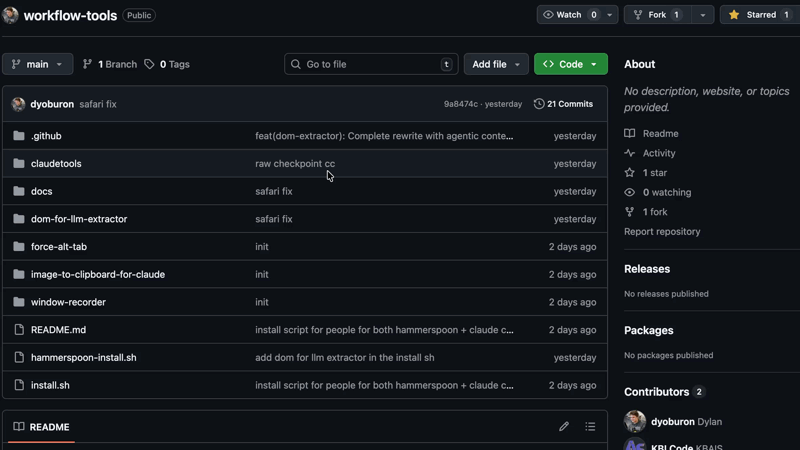

# DOM for LLM Extractor

A Hammerspoon tool that extracts rich DOM context optimized for LLM/AI agent consumption. Two modes available:

- **Drag Mode** (`Cmd+Shift+M`) - Drag a rectangle to extract multiple elements
- **Precision Mode** (`Cmd+Shift+K`) - Hover to inspect, click to capture single element with enhanced detail



## Features

- **Universal browser support** - Chrome, Safari, Arc, Edge (AppleScript), Firefox (bookmarklet)
- **Full Safari/IE11 compatibility** - ES5 syntax, SVGAnimatedString handling, polyfills included
- **Zero truncation** - All text, all elements, no "... and X more"
- **Agentic context** - 12 specialized extraction functions for AI agent automation
- **Error resilient** - All extractors wrapped in try-catch (handles React/Vue/Next.js edge cases)
- **Predicted actions** - Tells AI what clicking/interacting would likely do
- **Destination detection** - Shows WHERE links/buttons navigate to, not just "navigate"
- **No extensions required** - Pure AppleScript + JavaScript injection
- **Privacy-focused** - No network, no cookies, no sensitive data extraction
- **Network context** (Precision Mode) - Captures fetch/XHR requests since activation
- **Security hardened** - Input sanitization, length limits, ReDoS prevention

## Keybindings

| Hotkey | Mode | Description |
|--------|------|-------------|
| `Cmd+Shift+M` | Drag Mode | Drag a rectangle to extract multiple elements |
| `Cmd+Shift+K` | Precision Mode | Hover to inspect, click to capture single element |
| `Escape` | Both | Cancel/exit the current mode |

## Browser Support

| Browser | Method | Setup Required |
|---------|--------|----------------|
| Chrome | AppleScript injection | Enable: View → Developer → Allow JavaScript from Apple Events |
| Safari | AppleScript injection | Enable: Develop menu → Allow JavaScript from Apple Events |
| Arc | AppleScript injection | None |
| Microsoft Edge | AppleScript injection | None |
| Firefox | Bookmarklet auto-click | One-time bookmark setup |

## Installation

1. Copy `dom-for-llm-extractor/` to `~/.hammerspoon/workflow-tools/`
2. Add to your `~/.hammerspoon/init.lua`:
   ```lua
   dofile(os.getenv("HOME") .. "/.hammerspoon/workflow-tools/dom-for-llm-extractor/init.lua")
   ```
3. Reload Hammerspoon: `Cmd+Alt+Ctrl+R` or `open -g hammerspoon://reload`

### Firefox Setup (One-Time)

Firefox blocks AppleScript JavaScript injection for security. The tool auto-clicks bookmarklets instead.

**For Drag Mode (`Cmd+Shift+M`):**
1. Create a new bookmark named exactly: `Dom Extractor`
2. Set URL to contents of `bookmarklet.js`

**For Precision Mode (`Cmd+Shift+K`):**
1. Create a new bookmark named exactly: `Precision Inspector`
2. Set URL to contents of `bookmarklet-precision.js`

Both bookmarklets must be in: Bookmarks Menu, Bookmarks Toolbar, or Other Bookmarks (not nested folders).

## Usage

### Drag Mode (`Cmd+Shift+M`)
1. Focus any supported browser
2. Press `Cmd+Shift+M`
3. Drag a rectangle around the element(s) you want to extract
4. Release mouse - data is copied to clipboard instantly
5. Press `Escape` to cancel

### Precision Mode (`Cmd+Shift+K`)
1. Focus any supported browser
2. Press `Cmd+Shift+K`
3. Hover over elements - see real-time highlighting and info
4. Click to capture the hovered element
5. Press `Escape` to cancel

---

## Precision Mode - Detailed Breakdown

Precision Mode provides a rich, interactive inspection experience with real-time feedback and comprehensive element analysis.

### Visual Feedback

| Component | Description |
|-----------|-------------|
| **Highlight Box** | Blue border with semi-transparent overlay on hovered element |
| **Floating Label** | Shows selector, dimensions, predicted action, and destination |
| **Status Bar** | Top-center bar showing current element info and instructions |
| **Toast Notifications** | Animated slide-in notifications for capture success/failure |
| **Green Flash** | Visual confirmation when element is captured |

### Real-Time Information Display

The floating label shows:
```
button#submit.btn.primary
138×48 → /api/checkout [POST]
"Place Order"
```

- Line 1: Element selector (tag#id.classes)
- Line 2: Dimensions + destination (where it goes) or predicted action
- Line 3: Text content (if any)

### Destination Detection

Precision Mode intelligently detects WHERE interactive elements navigate to:

| Destination Type | Example Display |
|------------------|-----------------|
| External link | `↗ github.com/user/repo` |
| Internal path | `/dashboard/settings` |
| Anchor scroll | `⚓ #section-2` |
| Email link | `✉ support@example.com` |
| Phone link | `☎ +1-555-0123` |
| Form submission | `/api/submit [POST]` |
| Router link | `/products/123` |

### Network Interception

Precision Mode captures all network requests made while active:

```
| NETWORK CONTEXT (3 requests since activation)
|--- 1. GET /api/user → 200 (45ms)
|--- 2. POST /api/analytics → 204 (120ms) [from: button#track]
|--- 3. GET /api/products?page=2 → 200 (89ms)
```

Features:
- Intercepts both `fetch()` and `XMLHttpRequest`
- Records method, URL, status, duration
- Tracks which element initiated the request
- Sanitizes URLs (removes sensitive query params)
- Limited to 100 entries (FIFO eviction)

### Box Model Extraction

```
| BOX MODEL
|--- content: 138×48
|--- padding: 12px 24px 12px 24px
|--- border: 1px 1px 1px 1px
|--- margin: 0px 8px 0px 0px
|--- total: 164×74
|--- box-sizing: border-box
```

### CSS Variables Detection

Detects common CSS custom properties from `:root`:

```
| CSS VARIABLES
|--- --color-primary: #3b82f6 (from :root)
|--- --border-radius: 8px (from :root)
|--- --font-family: Inter, sans-serif (from :root)
```

### Full DOM Path

```
| DOM PATH
| html > body > div#app > main > section.checkout > form#order > button#submit
| depth: 7
```

### Precision Mode Output Format

```
+-----------------------------------------------------------------
| PRECISION EXTRACT
| url: /checkout
| viewport: 1728×959  scroll: 0,245
| mode: precision-hover
| captured: 2024-01-15T10:30:45.123Z
+-----------------------------------------------------------------
| SELECTED ELEMENT
| tag: button#submit-order.btn.btn-primary
| text: "Place Order"
| selector: form#checkout > div.actions > button#submit-order
+-----------------------------------------------------------------
| DOM PATH
| html > body > div#app > main > form#checkout > div.actions > button#submit-order
| depth: 7
+-----------------------------------------------------------------
| BOX MODEL
|--- content: 138×48
|--- padding: 12px 24px 12px 24px
|--- border: 1px 1px 1px 1px
|--- margin: 0px 0px 0px 0px
|--- total: 164×74
|--- box-sizing: border-box
+-----------------------------------------------------------------
| POSITION
|--- viewport: 651,469 (164×74)
|--- page: 651,714
|--- in-parent: 75.2%, 80.1% of div.actions
+-----------------------------------------------------------------
| VISUAL
|--- background: rgb(37, 99, 235)
|--- color: rgb(255, 255, 255)
|--- font: 600 16px/24px Inter
|--- border-radius: 8px
|--- cursor: pointer
+-----------------------------------------------------------------
| SEMANTIC
|--- role: button
|--- aria-label: Complete your purchase
+-----------------------------------------------------------------
| INTERACTIVE
|--- nativeInteractive: true
|--- focusable: true
|--- tabindex: 0
|--- cursorPointer: true
+-----------------------------------------------------------------
| PREDICTED ACTION
|--- submit-form
+-----------------------------------------------------------------
| DESTINATION
|--- type: form-action
|--- url: /api/orders
|--- display: /api/orders [POST]
|--- method: POST
+-----------------------------------------------------------------
| FORM CONTEXT
|--- form-id: checkout-form
|--- action: /api/orders
|--- method: POST
+-----------------------------------------------------------------
| NETWORK CONTEXT (2 requests since activation)
|--- 1. GET /api/cart → 200 (34ms)
|--- 2. GET /api/shipping-options → 200 (89ms)
+-----------------------------------------------------------------
| INSPECTOR ACTIVE: 12.4s
+-----------------------------------------------------------------
```

---

## Drag Mode Output Format

```
+-----------------------------------------------------------------
| DOM EXTRACT
| url: https://example.com/checkout
| viewport: 1728x959  scroll: 0,0
+-----------------------------------------------------------------
| SELECTION
| region: middle-center
| position: 45.2%, 52.1%
| pixels: 651,469 -> 789,517 (138x48)
+-----------------------------------------------------------------
| PRIMARY ELEMENT
| tag: button#submit-order.btn.btn-primary
| text: "Place Order"
| selector: #submit-order
|--- position
|    viewport: 651,469 (138x48)
|--- visual
|    background: rgb(37, 99, 235)
|    color: rgb(255, 255, 255)
|    font: 16px Inter
|--- design
|    borderRadius: 8px
|    animated: yes
|--- semantic
|    role: button
|    ariaLabel: Place your order
|--- interactive: native-button, focusable, pointer
|--- form
|    inForm: true
|    formId: checkout-form
|    formAction: /api/orders
|    formMethod: POST
|--- hierarchy: div.actions < form#checkout-form < main < div.container
|--- action: submit-form
|--- viewport
|    visibility: fully-visible
|
| AUTOMATION CONTEXT
|--- behavior (on activation)
|    outcome: form-submit
|    target: /api/orders
|    method: POST
|    isAjax: true
|--- input-method
|    clickable: true
|    clickMethod: left-click
|    keyboard: Enter or Space
|--- dependencies
|    form: #checkout-form
|--- constraints
|    required: true
|--- timing
|    hasTransition: true
|--- shortcuts
|    implicit: Enter (when form focused)
+-----------------------------------------------------------------
```

## Automation Context (Agentic Features)

12 specialized extraction functions designed for AI agent automation:

| Section | Purpose | Example Output |
|---------|---------|----------------|
| `behavior` | What happens on activation | `outcome: form-submit`, `willNavigate: true` |
| `input-method` | How to interact | `clickMethod: left-click`, `keyboard: Enter or Space` |
| `dependencies` | Connected elements | `form: #checkout-form`, `toggleTarget: #menu` |
| `constraints` | Input requirements | `required: true`, `pattern: [0-9]{3}-[0-9]{4}` |
| `step-context` | Multi-step flow position | `currentStep: 2`, `totalSteps: 4` |
| `data-binding` | Framework bindings | `vModel: email`, `reactState: formData` |
| `timing` | Transitions/animations | `hasTransition: true`, `debounce: 300ms` |
| `error-state` | Validation errors | `hasError: true`, `message: Invalid email` |
| `permissions` | Browser permissions needed | `requires: camera, microphone` |
| `async` | Loading/pagination state | `isLoading: true`, `hasInfiniteScroll: true` |
| `shortcuts` | Keyboard shortcuts | `accessKey: s`, `implicit: Enter` |
| `content` | Media type/format | `mediaType: video`, `editable: true` |

## Extracted Data Reference

### Core Information
| Field | Description |
|-------|-------------|
| `tag` | Element tag with ID and classes |
| `text` | Full text content (truncated to 200 chars in drag mode, 50 in precision) |
| `selector` | Unique CSS selector for targeting |

### Position & Layout
| Field | Description |
|-------|-------------|
| `viewport` | Pixel position and dimensions |
| `in-parent` | Percentage position within parent |
| `region` | Semantic region (top-left, middle-center, etc.) |

### Visual Properties
| Field | Description |
|-------|-------------|
| `background` | Background color |
| `color` | Text color |
| `font` | Font size and family |
| `fontWeight` | Font weight if not normal |
| `opacity` | If not fully opaque |
| `cursor` | Cursor style if interactive |
| `zIndex` | Z-index if layered |
| `hidden` | How element is hidden (display:none, visibility:hidden, opacity:0) |

### Design Properties
| Field | Description |
|-------|-------------|
| `borderRadius` | Border radius |
| `shadow` | Has box shadow |
| `padding` | Padding values |
| `margin` | Margin values |
| `layout` | flex or grid |
| `flexDirection` | Flex direction if flex |
| `gap` | Gap if flex/grid |
| `position` | CSS position if not static |
| `overflow` | Overflow if not visible |
| `animated` | Has CSS transitions |

### Semantic & Accessibility
| Field | Description |
|-------|-------------|
| `role` | ARIA role |
| `ariaLabel` | aria-label value (sanitized, max 200 chars) |
| `labelledBy` | Text from aria-labelledby element |
| `describedBy` | Text from aria-describedby element |
| `label` | Associated label text (for inputs) |
| `title` | Title attribute |
| `alt` | Alt text (for images) |
| `href` | Link URL (sanitized, no query params) |
| `data` | Non-sensitive data-* attributes (max 500 chars each) |

### Interactive State
| Field | Description |
|-------|-------------|
| `disabled` | Is disabled |
| `checked` | Is checked (checkbox/radio) |
| `selected` | Is selected |
| `expanded` | aria-expanded state |
| `focused` | Currently focused |
| `required` | Is required field |
| `invalid` | Has validation error |
| `readonly` | Is read-only |
| `value` | Current input value (not passwords) |
| `placeholder` | Placeholder text |

### Input Constraints
| Field | Description |
|-------|-------------|
| `minLength` | Minimum length |
| `maxLength` | Maximum length |
| `min` | Minimum value |
| `max` | Maximum value |
| `step` | Step value |
| `pattern` | Validation pattern |
| `inputMode` | Input mode hint |
| `autocomplete` | Autocomplete type |

### Interactivity Detection
| Field | Description |
|-------|-------------|
| `native-*` | Native interactive element (button, input, etc.) |
| `focusable` | Has tabIndex >= 0 |
| `onclick` | Has onclick handler |
| `pointer` | Has cursor: pointer |
| `role-*` | Has interactive ARIA role |
| `editable` | Is contenteditable |
| `draggable` | Is draggable |

### Context (Agentic)

#### Form Context
| Field | Description |
|-------|-------------|
| `inForm` | Is inside a form |
| `formId` | Form ID |
| `formName` | Form name |
| `formAction` | Form action URL (path only) |
| `formMethod` | Form method (GET/POST) |
| `formFields` | Number of form fields |
| `submitButton` | Submit button selector |

#### Table Context
| Field | Description |
|-------|-------------|
| `inTable` | Is inside a table |
| `row` | Row number (1-indexed) |
| `col` | Column number (1-indexed) |
| `totalRows` | Total rows |
| `totalCols` | Total columns |
| `isHeader` | Is a header cell (th) |
| `columnHeader` | Header text for this column |

#### List Context
| Field | Description |
|-------|-------------|
| `inList` | Is inside a list |
| `listType` | ul or ol |
| `position` | Position in list (1-indexed) |
| `totalItems` | Total list items |

#### Landmark Context
| Field | Description |
|-------|-------------|
| `landmark` | header, navigation, main, sidebar, footer, search, dialog, etc. |
| `landmarkLabel` | aria-label of landmark |

#### Modal Context
| Field | Description |
|-------|-------------|
| `inModal` | Is inside a modal/dialog |
| `modalId` | Modal ID |
| `modalTitle` | Modal title |
| `modalType` | Detection method (native, role, css-based) |

#### Sibling Context
| Field | Description |
|-------|-------------|
| `siblingIndex` | Position among siblings (1-indexed) |
| `totalSiblings` | Total sibling count |
| `prevSibling` | Previous sibling selector |
| `prevText` | Previous sibling text |
| `nextSibling` | Next sibling selector |
| `nextText` | Next sibling text |

#### Parent Hierarchy
Shows up to 5 parent elements: `div.card < section#main < main < body`

#### Predicted Action
| Action | Meaning |
|--------|---------|
| `submit-form` | Will submit a form |
| `navigate` | Will navigate to new page |
| `open-new-tab` | Will open in new tab |
| `scroll-to-anchor` | Will scroll to anchor |
| `toggle-expand` | Will expand/collapse |
| `toggle-check` | Will check/uncheck |
| `toggle-switch` | Will toggle switch |
| `select-option` | Will select option |
| `text-input` | Text input field |
| `number-input` | Number input field |
| `date-input` | Date/time input |
| `file-upload` | File upload |
| `slider-input` | Range slider |
| `color-picker` | Color picker |
| `dropdown-select` | Dropdown select |
| `video-player` | Video element |
| `audio-player` | Audio element |
| `switch-tab` | Tab switcher |
| `menu-action` | Menu item |
| `click-action` | Generic clickable |

#### Loading/Error Status
| Field | Description |
|-------|-------------|
| `loading` | Is in loading state |
| `loadingType` | Type (spinner, skeleton, etc.) |
| `hasError` | Has error state |
| `errorMessage` | Nearby error message text |

#### Viewport Visibility
| Field | Description |
|-------|-------------|
| `visibility` | fully-visible, partially-visible, off-screen |
| `clipped` | Which edge is clipped (top, bottom, left, right) |
| `direction` | Direction if off-screen (above, below, left, right) |

### Scroll Context
| Field | Description |
|-------|-------------|
| `scrollParent` | Scrollable parent selector |
| `scrollTop` | Current scroll position |
| `scrollHeight` | Total scrollable height |

### Pseudo Content
| Field | Description |
|-------|-------------|
| `before` | ::before content |
| `after` | ::after content |

## Files

| File | Purpose | Size |
|------|---------|------|
| `init.lua` | Hammerspoon hotkey binding, browser detection, Firefox bookmarklet auto-click | 5KB |
| `dom-extractor.js` | Drag mode source JavaScript | ~98KB |
| `dom-extractor.min.js` | Drag mode minified | ~35KB |
| `bookmarklet.js` | Drag mode Firefox bookmarklet | ~35KB |
| `precision-inspector.js` | Precision mode source JavaScript | ~75KB |
| `precision-inspector.min.js` | Precision mode minified | ~30KB |
| `bookmarklet-precision.js` | Precision mode Firefox bookmarklet | ~30KB |

## Security & Privacy

### Data Protection
- **No network access** - Everything runs locally
- **No extensions** - No browser permissions required  
- **No sensitive data** - Excludes: passwords, cookies, localStorage, tokens, auth data
- **URL sanitization** - Query params with sensitive names are stripped
- **Clipboard only** - Data goes to clipboard, nowhere else
- **Open source** - Full source available for audit

### Security Hardening (v2.0)

This version includes comprehensive security improvements:

| Protection | Description |
|------------|-------------|
| **Input Length Limits** | Text content limited to 10KB before processing |
| **Output Truncation** | Text truncated to 200 chars (drag) / 50 chars (precision) |
| **ReDoS Prevention** | onclick handlers limited to 1000 chars before regex |
| **Memory Protection** | Network log limited to 100 entries (FIFO eviction) |
| **Attribute Sanitization** | aria-label limited to 200 chars, control chars stripped |
| **Data Attribute Limits** | data-* values limited to 500 chars |
| **Class String Limits** | className limited to 1000 chars before pattern matching |
| **URL Sanitization** | Sensitive query params removed from all URLs |
| **Sensitive Data Filtering** | Passwords, tokens, API keys never extracted |

### Sensitive Parameters Filtered
```
token, key, secret, auth, password, api_key, apikey, 
access_token, refresh_token, session, sid, jwt, bearer, 
credential, private, apiSecret, client_secret
```

## How It Works

### Chrome, Safari, Arc, Edge
AppleScript directly injects JavaScript into the active tab:
```applescript
tell application "Chrome" to execute front window's active tab javascript "..."
```

### Firefox
Firefox blocks AppleScript JavaScript injection (security feature). Instead:
1. Hammerspoon uses System Events to open the Bookmarks menu
2. Searches for bookmark named exactly "Dom Extractor" or "Precision Inspector"
3. Clicks it to execute the bookmarklet

## Error Resilience

All 32+ extraction functions are wrapped in try-catch to handle:
- Next.js hydration elements
- React fiber nodes  
- Vue reactive proxies
- Shadow DOM elements
- Cross-origin iframes
- Elements removed during extraction
- Malformed DOM structures
- SVGAnimatedString edge cases

## Troubleshooting

### "Injection failed - Check browser permissions"
- **Chrome:** View → Developer → Allow JavaScript from Apple Events
- **Safari:** Settings → Advanced → Show Develop menu, then Develop → Allow JavaScript from Apple Events

### Firefox: "Bookmarklet not found"
- Drag mode bookmark must be named exactly `Dom Extractor`
- Precision mode bookmark must be named exactly `Precision Inspector`
- Must be in: Bookmarks Menu, Bookmarks Toolbar, or Other Bookmarks
- Nested folders are NOT searched (keep at top level)

### Hotkey doesn't work
1. Check Hammerspoon is running (menu bar icon)
2. Reload config: `open -g hammerspoon://reload`
3. Check console for errors

### No elements found
- Ensure you drag a rectangle (not just click)
- Some elements may be in iframes (not supported)
- Shadow DOM elements may not be detected

## Changelog

### v2.0.0 - Security & Quality Audit
- **Security**: Added comprehensive input sanitization and length limits
- **Security**: ReDoS prevention for regex operations
- **Security**: Memory protection with bounded collections
- **Feature**: Destination detection shows WHERE links/buttons navigate
- **Feature**: Animated toast notifications with icons
- **Feature**: Green flash effect on capture
- **Performance**: 60fps throttling with RAF batching
- **Performance**: Element change detection to skip redundant updates
- **Fix**: Variable shadowing in catch blocks
- **Fix**: Removed unused variables
- **Fix**: Promise rejection handling for clipboard operations

### v1.0.0 - Initial Release
- Drag mode with 12 agentic extraction functions
- Precision mode with real-time hover inspection
- Network interception for fetch/XHR
- Full ES5 compatibility for Safari/IE11
- Firefox bookmarklet support

## License

MIT - Part of the workflow-tools collection.
