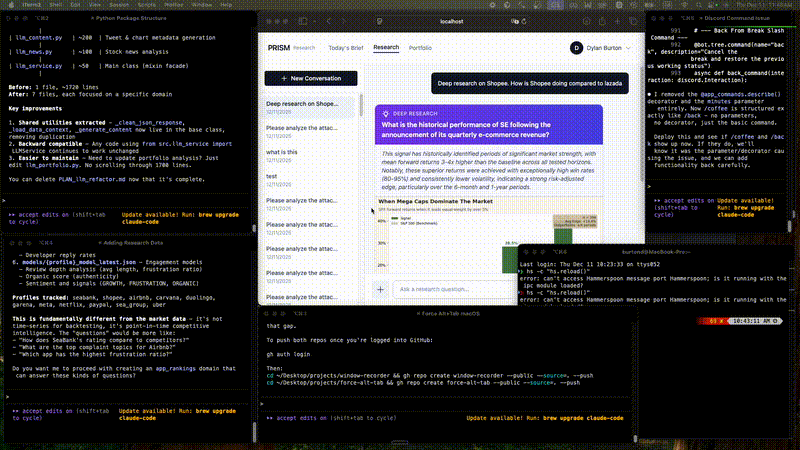

# Force Alt-Tab

A Hammerspoon script that fixes macOS Cmd+Tab behavior - apps always unhide when you switch to them.

## The Problem



On macOS, when you Cmd+Tab to a hidden app, it often doesn't appear. You have to:
- Press Cmd+Option while releasing Tab, or
- Click the app in the dock

This is annoying.

## The Solution

This script watches for app switches and automatically unhides the app + raises all its windows. Cmd+Tab just works.

## Installation

1. Install [Hammerspoon](https://www.hammerspoon.org/) (or `brew install --cask hammerspoon`)
2. Add the contents of `init.lua` to your `~/.hammerspoon/init.lua`
3. Reload Hammerspoon config

Or if you don't have an existing config:
```bash
cp init.lua ~/.hammerspoon/init.lua
```

## That's it

No configuration needed. Cmd+Tab now always brings apps forward.

## License

MIT
