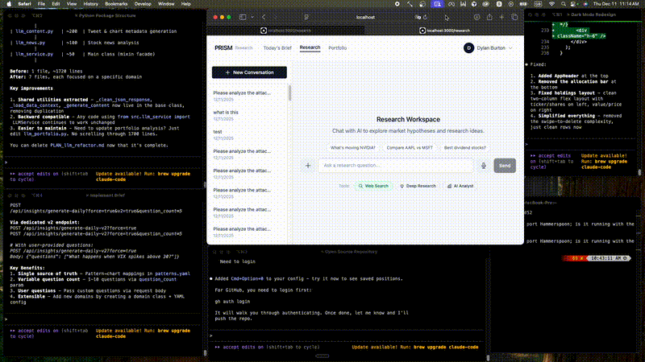

# Window Recorder

A simple Hammerspoon script to record and replay window positions with hotkeys.



## Why?

Existing window managers (Rectangle, Magnet, Moom) only offer preset positions. This lets you record *any* window position and replay it instantly.

## Installation

1. Install [Hammerspoon](https://www.hammerspoon.org/) (or `brew install --cask hammerspoon`)
2. Copy `init.lua` to `~/.hammerspoon/init.lua`
3. Reload Hammerspoon config

## Usage

| Hotkey | Action |
|--------|--------|
| `Cmd+Option+1` | Snap window to preset position (edit in script) |
| `Cmd+Option+R` | Record current window position to next slot (2-9) |
| `Cmd+Option+2-9` | Snap window to recorded position |
| `Cmd+Option+0` | Show all saved positions |
| `Cmd+Option+.` | Clear all saved positions |

## Example workflow

1. Arrange a window exactly where you want it
2. Press `Cmd+Option+R` → "Saved to Cmd+Option+2"
3. Now `Cmd+Option+2` snaps any focused window to that position
4. Repeat for more positions (slots 3-9)

Positions are saved to `~/.hammerspoon/window-positions.json` and persist across restarts.

## Customization

Edit the preset in slot 1:

```lua
win:setFrame(hs.geometry.rect(100, 100, 800, 600))
--                           x    y    width height
```

## License

MIT
